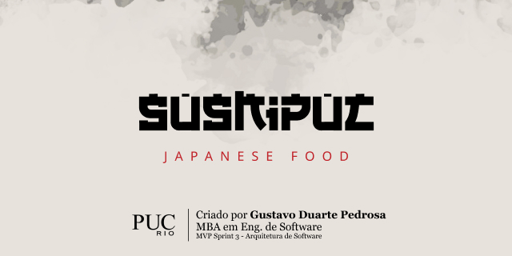

#
&nbsp;
&nbsp;


# Sobre o MVP
A aplicação consiste no projeto de conclusão de Sprint do MBA em Engenharia de Software pela PUC-Rio.

# Tecnologias
+ Python
+ Flask
+ OpenAPI
+ SQLite
+ SQLAlchemy
+ HTML5
+ CSS3
+ Bootstrap
+ JQuery

# Como executar?

A aplicação está dividida em 2 repositórios, sendo:
- Back-end (Este repositório)
- [Front-end](https://github.com/gustavoduartep/pucrio-mvp-front)

```powershell

# Acesse a pasta do da aplicação no terminal
$ cd pucrio-mvp-api

# Instale as dependências
$ pip install -r requirements.txt

# Ative o ambiente virtual (Windows)
$ env/Scripts/Activate.ps1

# Execute a aplicação em modo de desenvolvimento
(env)$ flask run --host 0.0.0.0 --port 5000

# Para desativar o ambiente, utilize:
(env)$ Deactivate

# A aplicação será aberta na porta:5000 - acesse http://localhost:5000
```

Em caso de dificuldades, por favor, entre em contato.